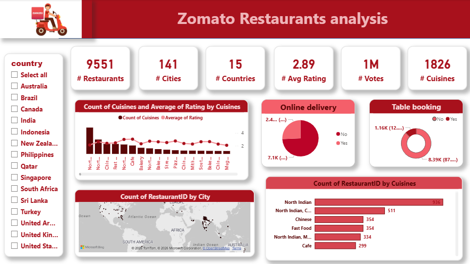

# 🍕 Zomato Restaurants Analysis — Power BI Dashboard

## 📌 Project Overview

An interactive **Power BI dashboard** analyzing Zomato's global restaurant data across **15 countries** and **141 cities**. The dashboard provides insights into cuisine trends, online delivery adoption, table booking patterns, and city-wise restaurant distribution.

---

## 📊 Key Metrics at a Glance

| Metric | Value |
|--------|-------|
| 🏪 Total Restaurants | 9,551 |
| 🌆 Cities Covered | 141 |
| 🌍 Countries | 15 |
| ⭐ Avg Rating | 2.89 |
| 🗳️ Total Votes | 1 Million+ |
| 🍽️ Cuisines | 1,826 |

---

## 🔍 Dashboard Features

- **Country-level filter** — Slice data by Australia, India, USA, UK, and 11 more countries
- **Cuisine Analysis** — Count of cuisines vs average rating comparison
- **Online Delivery** — % of restaurants offering delivery vs dine-in only
- **Table Booking** — Availability breakdown across restaurant types
- **City Map** — Geographic distribution of restaurants by city (RestaurantID count)
- **Top Cuisines** — North Indian, Chinese, Fast Food, Cafe ranked by restaurant count

---

## 🛠️ Tools Used

- **Power BI Desktop** — Dashboard design & DAX measures
- **Microsoft Bing Maps** — Geographic visualization
- **Data Source** — Zomato Restaurants Dataset (Kaggle)

---

## 📁 Files in this Repository

| File | Description |
|------|-------------|
| `Dashboard Project.pbix` | Power BI file — fully interactive |
| `Zomato_Dashboard_Preview.png` | Dashboard screenshot preview |

---

## 🚀 How to View the Interactive Dashboard

1. Download **`Dashboard Project.pbix`** from this repo
2. Open with **[Power BI Desktop](https://powerbi.microsoft.com/desktop/)** (free download)
3. Explore filters, slicers, and interactive visuals

> 💡 Power BI Desktop is free to download and use.

---

## 💡 Key Insights

- **North Indian cuisine** dominates with 938 restaurants — highest among all cuisine types
- Only **~13%** of restaurants offer table booking, indicating a major gap in the market
- **~74%** of restaurants do **not** offer online delivery — significant opportunity for platforms
- India has the highest restaurant concentration among all listed countries

---

## 👩‍💻 Author

**Aarzoo Panwar**
Final Year B.Tech — CSE (AI & ML) | DPG Institute of Technology & Management, Gurugram

